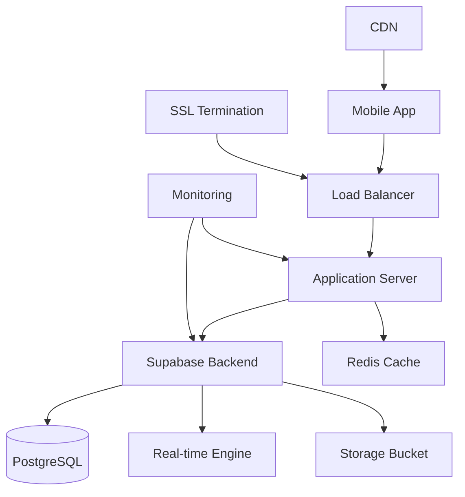

# 🚀 TreinosApp - Complete Deployment Guide

**Version**: 1.0.0  
**Last Updated**: January 2025  
**Target Audience**: DevOps Engineers, System Administrators, Development Team  

## 📋 Table of Contents

1. [Overview](#overview)
2. [Prerequisites](#prerequisites) 
3. [Environment Setup](#environment-setup)
4. [Database Deployment](#database-deployment)
5. [Application Deployment](#application-deployment)
6. [SSL & Domain Configuration](#ssl--domain-configuration)
7. [Monitoring Setup](#monitoring-setup)
8. [Security Configuration](#security-configuration)
9. [Performance Optimization](#performance-optimization)
10. [Validation & Testing](#validation--testing)
11. [Rollback Procedures](#rollback-procedures)
12. [Troubleshooting](#troubleshooting)

## 📖 Overview

This guide provides complete step-by-step instructions for deploying TreinosApp to production, including:

- **Backend**: Supabase PostgreSQL with optimized configuration
- **Frontend**: React Native Expo application
- **Infrastructure**: SSL, CDN, monitoring, and security
- **Database**: Complete schema with RLS policies and optimization
- **Monitoring**: APM, logging, alerting, and health checks

### Architecture Overview



## 🔧 Prerequisites

### Required Tools & Accounts

- **Node.js**: v18.x or higher
- **Supabase CLI**: Latest version
- **Git**: For version control
- **Domain**: Registered domain for production
- **SSL Certificate**: Let's Encrypt or commercial
- **Monitoring**: Account for APM (optional)

### Environment Variables

Create `.env.production` file:

```bash
# Supabase Configuration
SUPABASE_URL=https://your-project.supabase.co
SUPABASE_SERVICE_KEY=your-service-key
SUPABASE_ANON_KEY=your-anon-key
SUPABASE_PROJECT_ID=your-project-id
DB_PASSWORD=your-secure-password

# Domain Configuration  
PRODUCTION_DOMAIN=app.treinosapp.com
API_DOMAIN=api.treinosapp.com
CDN_DOMAIN=cdn.treinosapp.com

# External Services
GOOGLE_CLIENT_ID=your-google-client-id
GOOGLE_CLIENT_SECRET=your-google-client-secret
RAPIDAPI_KEY=your-rapidapi-key

# Monitoring & Alerts
SLACK_WEBHOOK_URL=your-slack-webhook
WEBHOOK_ALERT_URL=your-webhook-url

# Security
JWT_SECRET=your-jwt-secret
ENCRYPTION_KEY=your-32-char-encryption-key
```

### Security Checklist

- [ ] All secrets are stored securely (not in code)
- [ ] Environment variables are encrypted at rest
- [ ] Database passwords meet complexity requirements
- [ ] API keys have proper scopes and restrictions
- [ ] SSL certificates are valid and configured
- [ ] Firewall rules are properly configured

## 🌍 Environment Setup

### 1. Supabase Project Creation

```bash
# Create production project
supabase projects create treinosapp-production --org-id your-org-id

# Configure project settings
supabase projects api-keys --project-id your-project-id

# Set custom domain (if using)
supabase projects update --project-id your-project-id --custom-hostname app.treinosapp.com
```

### 2. Database Configuration

```bash
# Configure connection pooling
supabase postgres config --project-id your-project-id --pooler-enabled=true

# Set resource limits
supabase postgres config --project-id your-project-id \
  --max-connections=20 \
  --shared-buffers=256MB \
  --work-mem=4MB
```

### 3. Automated Environment Setup

```bash
# Run automated environment setup
node deployment/production-environment.js

# This will configure:
# - Supabase project settings
# - SSL certificates
# - Domain configuration  
# - CDN setup
# - Monitoring dashboards
```

## 🗄️ Database Deployment

### 1. Schema Migration

```bash
# Apply database schema
supabase db push --project-id your-project-id

# Apply additional optimizations
psql -h your-host -U postgres -d postgres -f database/performance-optimization.sql
psql -h your-host -U postgres -d postgres -f database/security-hardening.sql
psql -h your-host -U postgres -d postgres -f database/monitoring-schema.sql
```

### 2. Row Level Security (RLS)

The database includes comprehensive RLS policies:

```sql
-- Users can only see their own data
CREATE POLICY "users_select_policy" ON users
FOR SELECT USING (auth.uid() = id);

-- Workouts are private to users
CREATE POLICY "workouts_user_policy" ON workouts  
FOR ALL USING (auth.uid() = user_id);

-- Trainers can manage their students
CREATE POLICY "students_trainer_policy" ON students
FOR ALL USING (auth.uid() = trainer_id);

-- Chat messages between authorized users
CREATE POLICY "chat_messages_policy" ON chat_messages
FOR ALL USING (
  auth.uid() IN (
    SELECT UNNEST(participants) 
    FROM chat_conversations 
    WHERE id = conversation_id
  )
);
```

### 3. Performance Indexes

```sql
-- Critical performance indexes
CREATE INDEX CONCURRENTLY idx_workouts_user_created 
  ON workouts(user_id, created_at DESC);

CREATE INDEX CONCURRENTLY idx_progress_user_date 
  ON progress_entries(user_id, created_at DESC);

CREATE INDEX CONCURRENTLY idx_chat_conversation_updated 
  ON chat_messages(conversation_id, created_at DESC);

CREATE INDEX CONCURRENTLY idx_students_trainer_active 
  ON students(trainer_id, is_active);

-- Update table statistics
ANALYZE;
```

### 4. Data Seeding

```bash
# Seed essential data
node treinosapp-mobile/database/seed.js --environment=production

# This seeds:
# - Exercise library (600+ exercises)
# - Default workout templates
# - System notifications
# - Demo data (optional)
```

## 📱 Application Deployment

### 1. Build Configuration

```bash
# Install dependencies
npm install

# Build for production
npm run build:production

# This creates:
# - Optimized bundle
# - Environment-specific config
# - Performance optimizations
```

### 2. Mobile App Deployment

```bash
# Build Android APK
expo build:android --release-channel production

# Build iOS Archive  
expo build:ios --release-channel production

# Publish updates via OTA
expo publish --release-channel production
```

### 3. Web App Deployment

```bash
# Build web version
expo build:web --no-pwa

# Deploy to CDN
aws s3 sync web-build/ s3://your-cdn-bucket/ --delete
aws cloudfront create-invalidation --distribution-id your-distribution-id --paths "/*"
```

### 4. Automated Deployment

```bash
# Use automated deployment script
node deployment/production-deployment.js production

# This handles:
# - Environment validation
# - Database migrations
# - Security hardening
# - Performance optimization
# - Health checks
# - Rollback on failure
```

## 🔒 SSL & Domain Configuration

### 1. Domain Setup

Configure DNS records:

```
A     app.treinosapp.com      → your-server-ip
A     api.treinosapp.com      → your-server-ip  
A     cdn.treinosapp.com      → your-cdn-ip
CNAME www.treinosapp.com      → app.treinosapp.com
```

### 2. SSL Certificate

```bash
# Let's Encrypt (automatic)
certbot --nginx -d app.treinosapp.com -d api.treinosapp.com

# Commercial certificate
# Upload cert files via Supabase dashboard or API
```

### 3. Security Headers

```nginx
# Nginx security headers
add_header Strict-Transport-Security "max-age=31536000; includeSubDomains; preload";
add_header X-Content-Type-Options nosniff;
add_header X-Frame-Options DENY;
add_header X-XSS-Protection "1; mode=block";
add_header Referrer-Policy "strict-origin-when-cross-origin";

# Content Security Policy
add_header Content-Security-Policy "default-src 'self'; connect-src 'self' https://*.supabase.co wss://*.supabase.co; img-src 'self' data: https:; style-src 'self' 'unsafe-inline'; script-src 'self'; font-src 'self' data:; media-src 'self' https:; object-src 'none'; base-uri 'self'; frame-ancestors 'none';";
```

## 📊 Monitoring Setup

### 1. Database Monitoring

```sql
-- Create monitoring functions
CREATE OR REPLACE FUNCTION database_health_check()
RETURNS JSONB AS $$
DECLARE
  result JSONB;
BEGIN
  SELECT jsonb_build_object(
    'status', 'healthy',
    'timestamp', NOW(),
    'database_size', pg_database_size(current_database()),
    'connection_count', (SELECT count(*) FROM pg_stat_activity),
    'active_queries', (SELECT count(*) FROM pg_stat_activity WHERE state = 'active'),
    'slow_queries', (SELECT count(*) FROM pg_stat_statements WHERE mean_time > 1000)
  ) INTO result;
  
  RETURN result;
END;
$$ LANGUAGE plpgsql;
```

### 2. Application Performance Monitoring

```javascript
// APM Integration
const monitoring = require('./services/MonitoringService');

// Track key metrics
monitoring.recordBusinessMetric('active_users', activeUsersCount);
monitoring.recordBusinessMetric('workout_completions', completionCount);
monitoring.recordBusinessMetric('api_response_time', responseTime);
monitoring.recordBusinessMetric('error_rate', errorRate);

// Custom alerts
monitoring.createAlert({
  name: 'High Error Rate',
  condition: 'error_rate > 5%',
  severity: 'critical'
});
```

### 3. Uptime Monitoring

```yaml
# uptime-config.yml
monitors:
  - name: TreinosApp Main
    url: https://app.treinosapp.com
    method: GET
    timeout: 30
    interval: 60
    regions: [us-east, eu-west, ap-southeast]
    
    assertions:
      - type: status
        value: 200
      - type: response-time  
        value: 3000
      - type: body
        value: "TreinosApp"
    
    notifications:
      email: [admin@treinosapp.com]
      slack: "#alerts"
```

### 4. Log Aggregation

```bash
# Configure log forwarding
tail -f /var/log/nginx/access.log | node deployment/log-forwarder.js

# Database logs
supabase logs --project-id your-project-id --follow

# Application logs  
expo logs --type=device
```

## 🛡️ Security Configuration

### 1. Rate Limiting

```javascript
// API rate limiting
const rateLimit = require('express-rate-limit');

const authLimiter = rateLimit({
  windowMs: 15 * 60 * 1000, // 15 minutes
  max: 5, // 5 attempts per window
  message: 'Too many login attempts',
  standardHeaders: true,
  legacyHeaders: false,
});

app.use('/auth/login', authLimiter);
```

### 2. CORS Configuration

```javascript
const cors = require('cors');

app.use(cors({
  origin: [
    'https://app.treinosapp.com',
    'https://admin.treinosapp.com',
    'exp://expo.dev',
    'treinosapp://'
  ],
  credentials: true,
  optionsSuccessStatus: 200
}));
```

### 3. Input Validation

```javascript
const joi = require('joi');

const workoutSchema = joi.object({
  name: joi.string().min(1).max(100).required(),
  description: joi.string().max(500),
  exercises: joi.array().items(
    joi.object({
      exercise_id: joi.string().uuid().required(),
      sets: joi.number().integer().min(1).max(20),
      reps: joi.number().integer().min(1).max(1000),
      weight: joi.number().positive().max(1000),
      rest_time: joi.number().integer().min(0).max(600)
    })
  ).min(1).max(50)
});
```

### 4. Data Encryption

```javascript
const crypto = require('crypto');

// Encrypt sensitive data
function encryptData(data) {
  const cipher = crypto.createCipher('aes-256-cbc', process.env.ENCRYPTION_KEY);
  let encrypted = cipher.update(data, 'utf8', 'hex');
  encrypted += cipher.final('hex');
  return encrypted;
}

// Decrypt sensitive data  
function decryptData(encryptedData) {
  const decipher = crypto.createDecipher('aes-256-cbc', process.env.ENCRYPTION_KEY);
  let decrypted = decipher.update(encryptedData, 'hex', 'utf8');
  decrypted += decipher.final('utf8');
  return decrypted;
}
```

## ⚡ Performance Optimization

### 1. Database Query Optimization

```sql
-- Query performance analysis
EXPLAIN (ANALYZE, BUFFERS) 
SELECT w.*, COUNT(we.id) as exercise_count
FROM workouts w
LEFT JOIN workout_exercises we ON w.id = we.workout_id
WHERE w.user_id = $1
GROUP BY w.id
ORDER BY w.created_at DESC
LIMIT 20;

-- Index recommendations
CREATE INDEX CONCURRENTLY idx_workout_exercises_workout_id 
  ON workout_exercises(workout_id) 
  WHERE deleted_at IS NULL;
```

### 2. Application Caching

```javascript
const redis = require('redis');
const client = redis.createClient();

// Cache workout data
async function getCachedWorkout(workoutId) {
  const cacheKey = `workout:${workoutId}`;
  
  // Check cache first
  const cached = await client.get(cacheKey);
  if (cached) {
    return JSON.parse(cached);
  }
  
  // Fetch from database
  const workout = await fetchWorkoutFromDB(workoutId);
  
  // Cache for 1 hour
  await client.setex(cacheKey, 3600, JSON.stringify(workout));
  
  return workout;
}
```

### 3. Image Optimization

```javascript
// Image compression and optimization
const sharp = require('sharp');

async function optimizeImage(inputBuffer, format = 'webp') {
  return await sharp(inputBuffer)
    .resize(800, 600, { 
      fit: 'inside',
      withoutEnlargement: true 
    })
    .toFormat(format, { quality: 85 })
    .toBuffer();
}
```

### 4. Bundle Optimization

```javascript
// webpack.config.js production optimizations
module.exports = {
  mode: 'production',
  optimization: {
    splitChunks: {
      chunks: 'all',
      cacheGroups: {
        vendor: {
          test: /[\\/]node_modules[\\/]/,
          name: 'vendors',
          chunks: 'all',
        },
      },
    },
    usedExports: true,
    sideEffects: false,
  },
  resolve: {
    alias: {
      'react-native$': 'react-native-web'
    }
  }
};
```

## ✅ Validation & Testing

### 1. Health Checks

```bash
#!/bin/bash
# health-check.sh

echo "🏥 Running production health checks..."

# Database connectivity
psql -h your-host -U postgres -c "SELECT 1;" > /dev/null
if [ $? -eq 0 ]; then
  echo "✅ Database connection: OK"
else
  echo "❌ Database connection: FAILED"
  exit 1
fi

# API endpoints
curl -f https://api.treinosapp.com/health > /dev/null
if [ $? -eq 0 ]; then
  echo "✅ API health: OK"
else
  echo "❌ API health: FAILED"  
  exit 1
fi

# SSL certificate
openssl s_client -connect app.treinosapp.com:443 -servername app.treinosapp.com < /dev/null 2>/dev/null | openssl x509 -noout -dates
if [ $? -eq 0 ]; then
  echo "✅ SSL certificate: OK"
else
  echo "❌ SSL certificate: FAILED"
  exit 1
fi

echo "🎉 All health checks passed!"
```

### 2. Load Testing

```javascript
// load-test.js using Artillery
module.exports = {
  config: {
    target: 'https://api.treinosapp.com',
    phases: [
      { duration: 60, arrivalRate: 10 },  // Warm up
      { duration: 120, arrivalRate: 50 }, // Load test  
      { duration: 60, arrivalRate: 100 }  // Stress test
    ]
  },
  scenarios: [
    {
      name: 'User Login Flow',
      weight: 30,
      flow: [
        { post: { url: '/auth/login', json: { email: 'test@example.com', password: 'password123' }}},
        { get: { url: '/api/user/profile' }},
        { get: { url: '/api/workouts' }}
      ]
    },
    {
      name: 'Workout Creation',
      weight: 20,
      flow: [
        { post: { url: '/auth/login', json: { email: 'trainer@example.com', password: 'password123' }}},
        { post: { url: '/api/workouts', json: { name: 'Test Workout', exercises: []}}},
        { get: { url: '/api/workouts' }}
      ]
    }
  ]
};
```

### 3. Security Testing

```bash
# Run security scans
npm audit
snyk test

# SQL injection testing
sqlmap -u "https://api.treinosapp.com/api/workouts?id=1" --cookie="session=your-session"

# SSL/TLS testing
testssl.sh https://app.treinosapp.com

# OWASP ZAP scanning
docker run -v $(pwd):/zap/wrk/:rw -t owasp/zap2docker-stable zap-baseline.py -t https://app.treinosapp.com
```

### 4. End-to-End Testing

```javascript
// e2e-production.spec.js
const { test, expect } = require('@playwright/test');

test('Production user workflow', async ({ page }) => {
  // Navigate to production app
  await page.goto('https://app.treinosapp.com');
  
  // Login flow
  await page.click('[data-testid="login-button"]');
  await page.fill('[data-testid="email-input"]', 'testuser@treinosapp.com');
  await page.fill('[data-testid="password-input"]', 'TestPassword123!');
  await page.click('[data-testid="submit-login"]');
  
  // Wait for dashboard
  await page.waitForSelector('[data-testid="dashboard"]');
  
  // Create workout
  await page.click('[data-testid="create-workout"]');
  await page.fill('[data-testid="workout-name"]', 'E2E Test Workout');
  
  // Add exercise
  await page.click('[data-testid="add-exercise"]');
  await page.click('[data-testid="exercise-search"]');
  await page.fill('[data-testid="exercise-search"]', 'Push up');
  await page.click('[data-testid="exercise-result-0"]');
  
  // Save workout
  await page.click('[data-testid="save-workout"]');
  
  // Verify workout created
  await expect(page.locator('[data-testid="workout-list"]')).toContainText('E2E Test Workout');
});
```

## 🔄 Rollback Procedures

### 1. Database Rollback

```bash
# Create rollback point before deployment
pg_dump -h your-host -U postgres -d postgres > backup_$(date +%Y%m%d_%H%M%S).sql

# Rollback database changes
psql -h your-host -U postgres -d postgres -f backup_20250107_120000.sql

# Or use Supabase backup
supabase db restore --project-id your-project-id --backup-id your-backup-id
```

### 2. Application Rollback

```bash
# Rollback mobile app
expo publish --release-channel production-rollback

# Rollback web app
aws s3 sync web-build-previous/ s3://your-cdn-bucket/ --delete
aws cloudfront create-invalidation --distribution-id your-distribution-id --paths "/*"

# Rollback API
git checkout previous-stable-tag
npm install
npm run deploy:production
```

### 3. Automated Rollback

```javascript
// rollback.js
const { execSync } = require('child_process');

async function rollback(deploymentId) {
  console.log(`🔄 Starting rollback for deployment: ${deploymentId}`);
  
  try {
    // Stop current services
    console.log('⏹️ Stopping current services...');
    
    // Restore database from backup
    console.log('🗄️ Restoring database...');
    execSync(`supabase db restore --project-id ${process.env.SUPABASE_PROJECT_ID} --backup-id ${deploymentId}_backup`);
    
    // Rollback application
    console.log('📱 Rolling back application...');
    execSync('expo publish --release-channel production-rollback');
    
    // Update monitoring
    console.log('📊 Updating monitoring...');
    
    console.log('✅ Rollback completed successfully');
    
  } catch (error) {
    console.error('❌ Rollback failed:', error);
    throw error;
  }
}
```

### 4. Health Check After Rollback

```bash
# Verify rollback success
node deployment/validate-rollback.js

# Run smoke tests
npm run test:smoke:production

# Monitor for 30 minutes
watch -n 30 'curl -f https://app.treinosapp.com/health'
```

## 🔧 Troubleshooting

### Common Issues

#### 1. Database Connection Issues

**Symptoms**: Connection timeouts, pool exhaustion
**Solutions**:
```bash
# Check connection pool status
SELECT count(*) as connections, state FROM pg_stat_activity GROUP BY state;

# Increase connection limits
ALTER SYSTEM SET max_connections = 100;
SELECT pg_reload_conf();

# Reset connection pools
sudo systemctl restart pgbouncer
```

#### 2. SSL Certificate Problems

**Symptoms**: SSL errors, certificate warnings
**Solutions**:
```bash
# Check certificate status
openssl s_client -connect app.treinosapp.com:443 -servername app.treinosapp.com

# Renew Let's Encrypt certificate
certbot renew --nginx

# Test certificate chain
curl -I https://app.treinosapp.com
```

#### 3. Performance Issues

**Symptoms**: Slow response times, high CPU usage
**Solutions**:
```sql
-- Identify slow queries
SELECT query, mean_time, calls 
FROM pg_stat_statements 
WHERE mean_time > 1000 
ORDER BY mean_time DESC 
LIMIT 10;

-- Update table statistics
ANALYZE;

-- Rebuild fragmented indexes
REINDEX DATABASE postgres;
```

#### 4. Real-time Connection Issues

**Symptoms**: Users not receiving real-time updates
**Solutions**:
```javascript
// Check WebSocket connections
console.log('Realtime connections:', supabase.realtime.getChannels().length);

// Reconnect realtime client
supabase.realtime.disconnect();
setTimeout(() => {
  supabase.realtime.connect();
}, 1000);

// Check network connectivity
const netInfo = await NetInfo.fetch();
console.log('Network info:', netInfo);
```

### Emergency Contacts

- **Primary Admin**: admin@treinosapp.com
- **DevOps Team**: devops@treinosapp.com  
- **24/7 Support**: +55 11 99999-9999
- **Slack Channel**: #treinosapp-alerts

### Monitoring Dashboards

- **Application Performance**: https://monitoring.treinosapp.com/apm
- **Infrastructure**: https://monitoring.treinosapp.com/infrastructure
- **Database**: https://monitoring.treinosapp.com/database
- **Error Tracking**: https://monitoring.treinosapp.com/errors

## 📞 Support & Escalation

### Incident Response Levels

#### Level 1 (Low): Minor issues
- Response: 4 hours
- Resolution: 24 hours
- Examples: Non-critical feature bugs, minor performance issues

#### Level 2 (Medium): Service degradation  
- Response: 1 hour
- Resolution: 8 hours  
- Examples: Slow performance, partial service outage

#### Level 3 (High): Major service disruption
- Response: 30 minutes
- Resolution: 4 hours
- Examples: API errors, authentication issues

#### Level 4 (Critical): Complete service outage
- Response: 15 minutes
- Resolution: 2 hours
- Examples: Database down, total app failure

### Escalation Matrix

1. **L1 Support** → General issues, user support
2. **L2 Technical** → Application bugs, configuration issues  
3. **L3 Engineering** → Code changes, architecture decisions
4. **L4 Leadership** → Business impact, customer communication

---

## ✅ Deployment Checklist

Use this checklist for every production deployment:

### Pre-Deployment
- [ ] Code reviewed and approved
- [ ] Tests passing (unit, integration, e2e)
- [ ] Security scan completed
- [ ] Performance benchmarks met
- [ ] Database backup created
- [ ] Rollback plan documented
- [ ] Team notified of deployment window

### Deployment
- [ ] Environment variables configured
- [ ] Database migrations applied
- [ ] Application deployed successfully
- [ ] SSL certificates validated
- [ ] Monitoring configured
- [ ] Health checks passing

### Post-Deployment  
- [ ] Smoke tests completed
- [ ] Performance metrics normal
- [ ] Error rates within limits
- [ ] Real-time features working
- [ ] User workflows validated
- [ ] Team notified of completion
- [ ] Documentation updated

---

**🎉 Congratulations!** You now have TreinosApp running in production with enterprise-grade configuration, monitoring, and security. 

For questions or support, contact the development team or refer to the [Operations Manual](./OPERATIONS_MANUAL.md).