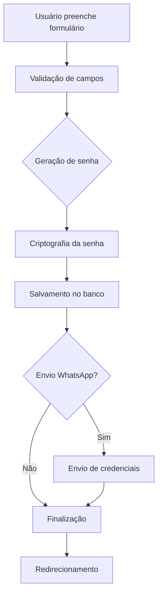
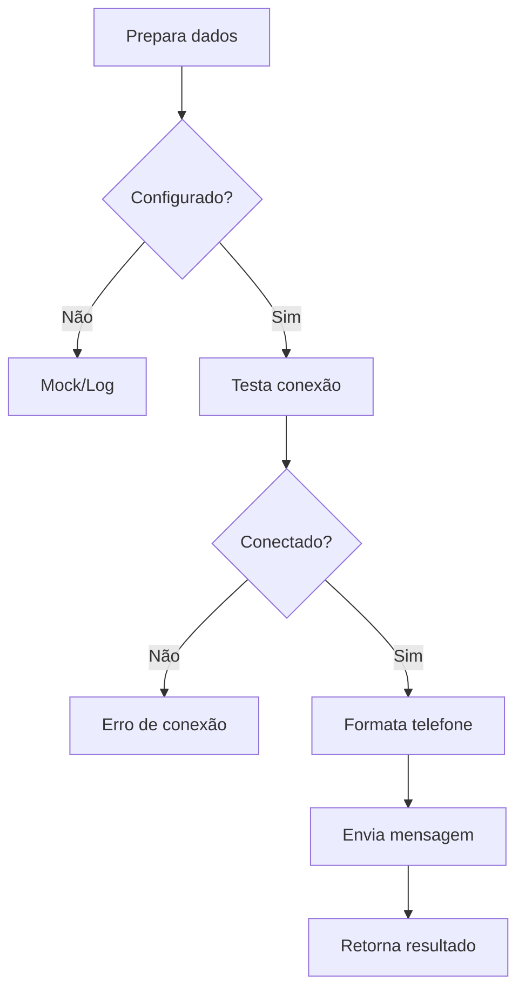

# Funcionalidade: Adicionar Alunos com WhatsApp

Esta funcionalidade permite adicionar novos alunos ao sistema e enviar automaticamente as credenciais de login via WhatsApp.

## Funcionalidades Implementadas

### ✅ Página de Adicionar Aluno
- **Localização:** `/dashboard/students/add`
- **Formulário completo** com todos os campos necessários
- **Validação** de campos obrigatórios
- **Geração automática** de senha
- **Envio automático** de credenciais via WhatsApp

### ✅ Página de Listagem de Alunos
- **Localização:** `/dashboard/students`
- **Lista completa** de alunos cadastrados
- **Botão para adicionar** novos alunos
- **Informações detalhadas** de cada aluno
- **Status visual** (ativo/inativo)

### ✅ API de Estudantes
- **Endpoint:** `/api/students`
- **Métodos:** GET (listar) e POST (adicionar)
- **Validação completa** de dados
- **Criptografia** de senhas
- **Integração** com WhatsApp

### ✅ Serviço de WhatsApp
- **Localização:** `/src/lib/whatsapp-service.ts`
- **Integração** com WhatsApp Business API
- **Fallback** para desenvolvimento (mock)
- **Formatação** automática de telefones
- **Mensagens personalizadas**

### ✅ Página de Teste WhatsApp
- **Localização:** `/dashboard/settings/whatsapp-test`
- **Teste de conexão** com a API
- **Envio de mensagens** de teste
- **Verificação** de configuração

## Como Usar

### 1. Adicionar Novo Aluno

1. Acesse `/dashboard/students`
2. Clique em "Adicionar Aluno"
3. Preencha o formulário:
   - **Nome Completo** (obrigatório)
   - **Email** (obrigatório - será usado como login)
   - **WhatsApp** (obrigatório)
   - **Data de Nascimento** (opcional)
   - **Plano** (opcional)
   - **Instrutor Responsável** (opcional)
4. Clique em "Adicionar Aluno e Enviar Login"
5. O sistema irá:
   - Gerar uma senha automática
   - Criar o cadastro do aluno
   - Enviar as credenciais via WhatsApp

### 2. Configurar WhatsApp

1. Crie um arquivo `.env.local` na raiz do projeto
2. Adicione as variáveis do WhatsApp:

```env
# WhatsApp Business API
WHATSAPP_API_KEY=your_api_key
WHATSAPP_PHONE_NUMBER_ID=your_phone_number_id
WHATSAPP_ACCESS_TOKEN=your_access_token

# URL da aplicação
NEXT_PUBLIC_APP_URL=http://localhost:3000
```

3. Consulte `docs/WHATSAPP_SETUP.md` para instruções detalhadas

### 3. Testar Integração

1. Acesse `/dashboard/settings/whatsapp-test`
2. Preencha os dados de teste
3. Clique em "Testar Envio WhatsApp"
4. Verifique o resultado

## Estrutura de Arquivos

```
src/
├── app/
│   ├── dashboard/
│   │   ├── students/
│   │   │   ├── add/
│   │   │   │   └── page.tsx          # Página de adicionar aluno
│   │   │   └── page.tsx              # Página de listagem
│   │   └── settings/
│   │       └── whatsapp-test/
│   │           └── page.tsx          # Página de teste
│   └── api/
│       ├── students/
│       │   └── route.ts              # API de estudantes
│       └── whatsapp/
│           └── test/
│               └── route.ts          # API de teste WhatsApp
├── lib/
│   └── whatsapp-service.ts           # Serviço WhatsApp
└── docs/
    ├── ADD_STUDENT_FEATURE.md        # Esta documentação
    └── WHATSAPP_SETUP.md             # Configuração WhatsApp
```

## Fluxo de Funcionamento

### 1. Adição de Aluno



### 2. Envio de WhatsApp



## Mensagem Enviada

A mensagem enviada via WhatsApp inclui:

```
Olá [Nome]! 

Seu acesso ao sistema da academia foi criado com sucesso!

📱 **Credenciais de Login:**
• Email: [email]
• Senha: [senha_gerada]

🔗 **Link de acesso:** [url_da_aplicacao]/login

⚠️ **Importante:** 
- Altere sua senha no primeiro acesso
- Mantenha suas credenciais seguras
- Em caso de dúvidas, entre em contato conosco

Bem-vindo(a) à nossa academia! 💪
```

## Validações Implementadas

### Campos Obrigatórios
- ✅ Nome completo
- ✅ Email (formato válido)
- ✅ WhatsApp (formato brasileiro)

### Formato de Telefone
- ✅ Aceita: `(11) 99999-9999`
- ✅ Aceita: `11999999999`
- ✅ Aceita: `11 99999 9999`

### Formato de Email
- ✅ Validação de formato básico
- ✅ Verificação de domínio

## Segurança

### Senhas
- ✅ Geração automática de 8 caracteres
- ✅ Criptografia com bcrypt
- ✅ Senha temporária (usuário deve alterar)

### Dados
- ✅ Validação de entrada
- ✅ Sanitização de dados
- ✅ Logs de auditoria

## Próximas Melhorias

### Funcionalidades Planejadas
- [ ] Templates de mensagem personalizáveis
- [ ] Confirmação de entrega via webhook
- [ ] Retry automático para falhas
- [ ] Analytics de entrega
- [ ] Múltiplos provedores de WhatsApp

### Melhorias de UX
- [ ] Preview da mensagem antes do envio
- [ ] Opção de não enviar WhatsApp
- [ ] Histórico de envios
- [ ] Notificações de status

### Integrações
- [ ] Banco de dados real
- [ ] Autenticação de usuários
- [ ] Permissões por perfil
- [ ] Backup automático

## Troubleshooting

### Problemas Comuns

**1. WhatsApp não envia mensagens**
- Verifique as variáveis de ambiente
- Teste a conexão em `/dashboard/settings/whatsapp-test`
- Verifique os logs do console

**2. Formato de telefone inválido**
- Use o formato: `(11) 99999-9999`
- Certifique-se de que o número tem WhatsApp

**3. Email já cadastrado**
- Implementar verificação de duplicatas
- Adicionar validação no backend

**4. Senha não chega**
- Verifique se o número está correto
- Teste com um número conhecido
- Verifique se o WhatsApp está ativo

## Suporte

Para dúvidas ou problemas:

1. **Consulte a documentação** em `docs/`
2. **Teste a integração** em `/dashboard/settings/whatsapp-test`
3. **Verifique os logs** do console
4. **Reporte bugs** com detalhes do erro 